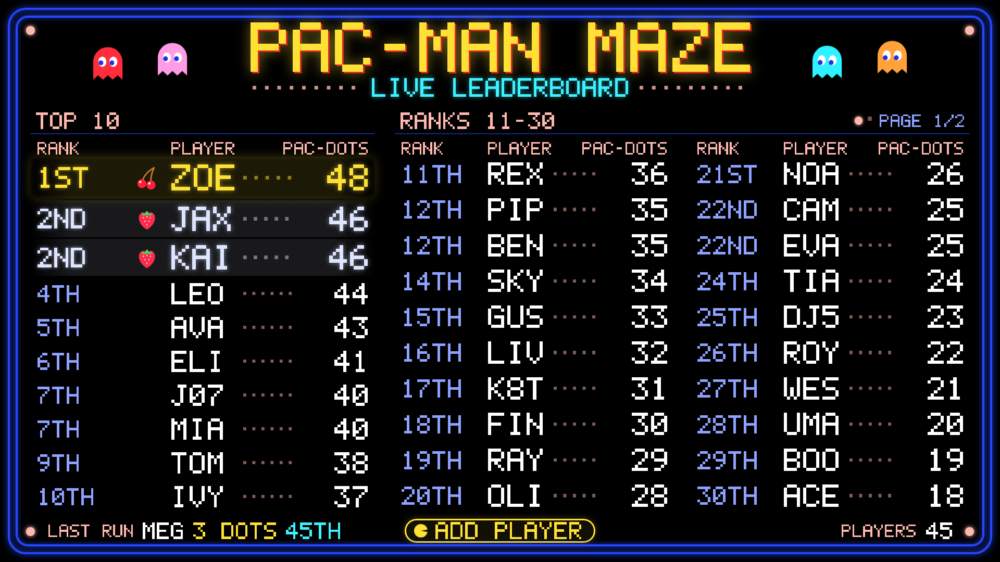
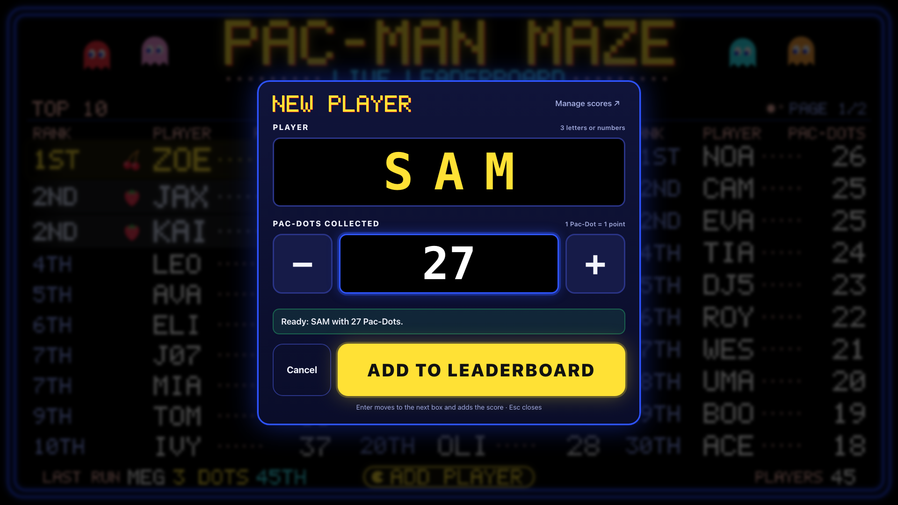
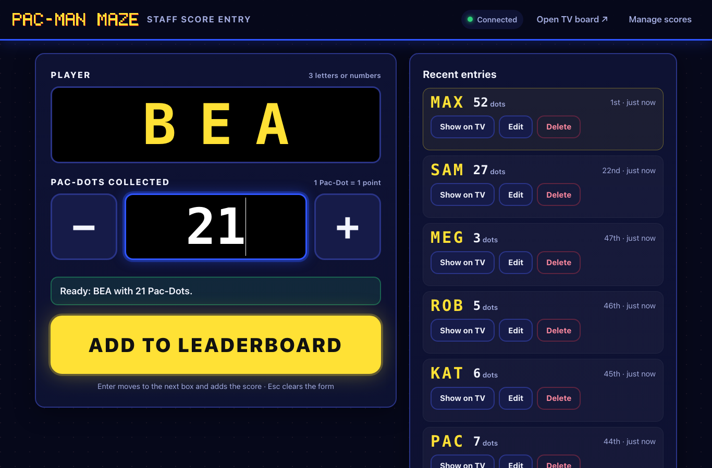
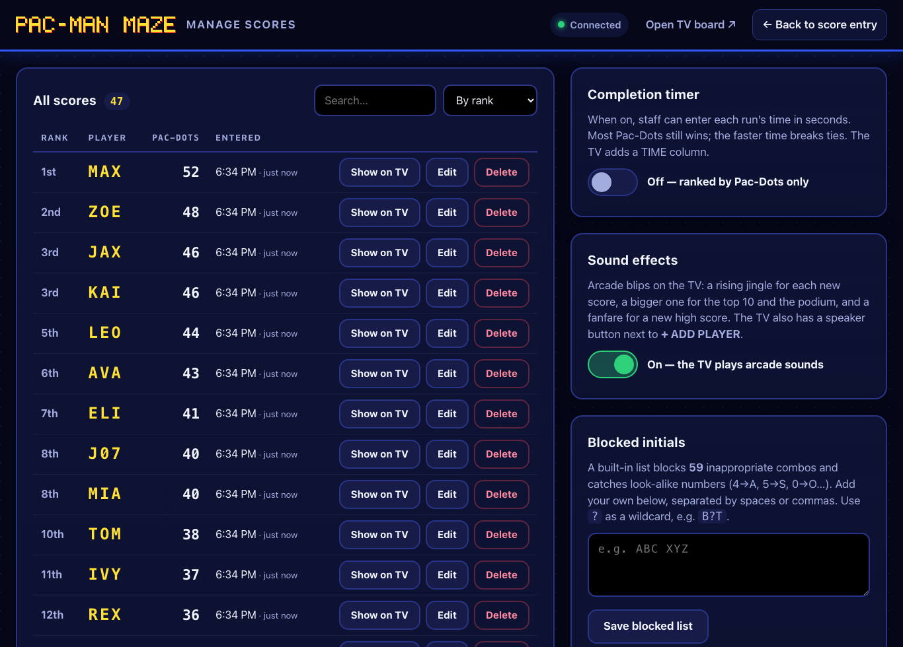
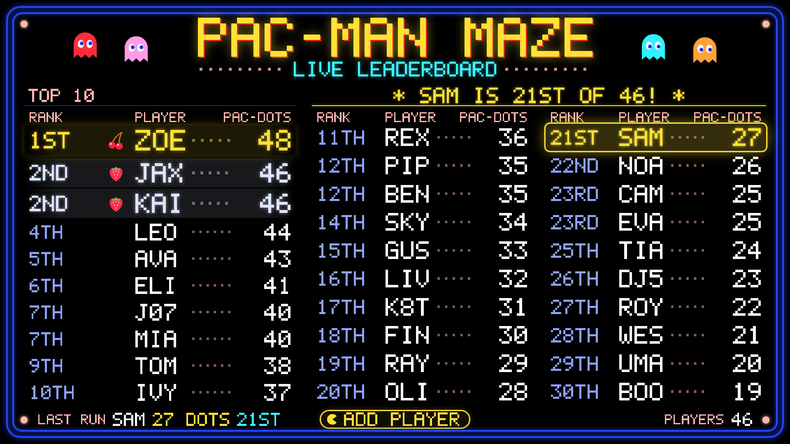
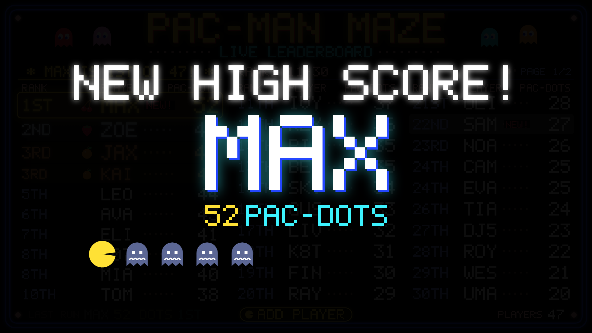
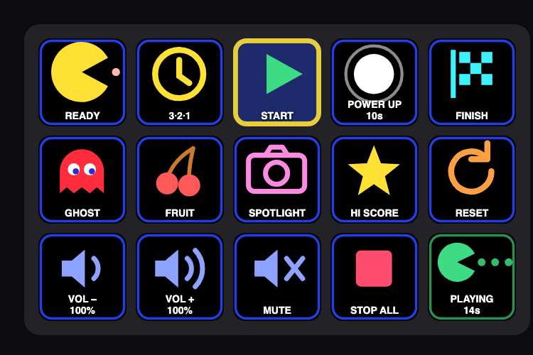

# ᗧ • • • Pac-Man Maze — Live Leaderboard

A retro arcade scoreboard for the Pac-Man Maze Halloween attraction. It runs entirely on one Mac mini
connected to a TV — no internet, no accounts, no cloud.

Kids run the maze collecting Pac-Dots (bean bags). Each Pac-Dot is 1 point. At the exit, staff count
the dots, the child picks 3-character initials (`MAX`, `J07`, …), staff type them in, and the TV
updates instantly — jumping straight to that kid's spot on the board so they can grab a photo.



| Screen | Address | Who uses it |
| --- | --- | --- |
| **TV leaderboard** (with built-in **+ ADD PLAYER** entry) | `http://localhost:3000/` | Everyone / staff at the Mac |
| Staff entry (tablet- or laptop-friendly) | `http://localhost:3000/admin` | Staff on a second device |
| Manage scores | `http://localhost:3000/admin/settings` | Staff: edit, delete, export, reset |

An optional **Stream Deck** runs the show itself — READY, 3·2·1, POWER UP, FINISH — driving the
sounds and the TV from one set of physical keys. See [Running the show with a Stream Deck](#running-the-show-with-a-stream-deck).

---

## Mac mini setup

### 1. Install dependencies (one time, needs internet)

1. Install **Google Chrome** (for full-screen kiosk mode): <https://www.google.com/chrome/>
2. Install **Node.js 22.18 or newer**. The easiest way is [Homebrew](https://brew.sh):
   ```bash
   brew install node
   ```
3. Get the project into a simple folder such as `~/pacman-maze` (avoid Desktop/Documents/Downloads
   if you plan to use auto-start — see below). In Terminal:
   ```bash
   git clone https://github.com/Linesmerrill/pacman-live-leaderboard.git ~/pacman-maze
   cd ~/pacman-maze
   npm install
   ```
   The app itself has **zero runtime packages** — it uses Node's built-in web server and SQLite.
   `npm install` only adds the TypeScript checker used by `npm run typecheck`, so you can skip it on
   a Mac that will only run the event.

### 2. Start the application

```bash
cd ~/pacman-maze
npm start
```

You'll see the addresses to open, e.g.:

```
  TV leaderboard:  http://localhost:3000/
  Staff entry:     http://localhost:3000/admin
  Manage scores:   http://localhost:3000/admin/settings
  On this Wi-Fi:   http://192.168.1.20:3000/admin
```

Leave that Terminal window open. Stop the app with **Ctrl+C** (scores are already saved).

### 3. Open the staff screen

**Fastest: right on the TV.** With a keyboard and mouse plugged into the Mac mini:

- Click **+ ADD PLAYER** at the bottom of the leaderboard, **or just start typing the initials** —
  the entry panel pops open with the first letter already filled in.
- Type 3 letters/numbers → the cursor jumps to **PAC-DOTS** → type the count (or use the big − / +).
- Press **Enter** (or click **ADD TO LEADERBOARD**). The panel closes and the board shows the player.
- **Esc** closes the panel. The panel has **Undo** for the last player you added, and a
  **Manage scores** link.



**From a tablet or laptop** on the same Wi-Fi, open the “On this Wi-Fi” address printed at startup
(e.g. `http://192.168.1.20:3000/admin`). It has the same entry form plus a list of recent entries with
**Show on TV**, **Edit** and **Delete** buttons.



### 4. Open the leaderboard screen

On the Mac mini, open Chrome to **`http://localhost:3000/`**.

### 5. Put the leaderboard in full-screen mode

Pick one:

- **Kiosk mode (recommended):** in a second Terminal window run
  ```bash
  npm run kiosk
  ```
  Chrome opens the board full-screen with no toolbars, using its own clean profile, and keeps the Mac
  from sleeping. Quit kiosk mode with **Cmd+Q**.
- **Normal Chrome:** press **Ctrl+Cmd+F** (View → Enter Full Screen), or **double-click** the board.

The mouse pointer hides itself after 3 seconds; move the mouse to bring it back.

### 6. Backup, export, and reset scores

Scores are written to SQLite on every submission (`data/pacman-maze.db`). They survive browser
refreshes, closed tabs, app restarts and Mac restarts.

| Task | How |
| --- | --- |
| **Export to spreadsheet** | Manage scores → **Download CSV** (rank, player, pac_dots, completion_time_seconds, submitted_at) |
| **Backup** | Manage scores → **Save backup now**, or in Terminal: `npm run backup`. Files go to `backups/`. Safe while the app is running. |
| **Reset for a new night** | Manage scores → **Clear leaderboard…** → type `RESET`. A backup is saved automatically first (`backups/pacman-maze-before-reset-….db`). |
| **Restore a backup** | Stop the app (Ctrl+C), copy the backup over `data/pacman-maze.db` (delete any `data/pacman-maze.db-wal` / `-shm` files), then `npm start`. |
| **Fix one score** | **Edit** / **Delete** in Manage scores or in the /admin recent list. |

For an off-site copy, drag the `backups/` folder (or the whole `data/` folder while the app is stopped)
to a USB stick.



---

## How the TV board works

| Spotlight — the TV jumps to each new player | NEW HIGH SCORE! celebration |
| --- | --- |
|  |  |

- **Top 10 always pinned** on the left, with 1st–3rd in gold/silver/bronze with fruit bonuses. Tied
  scores share a rank (1st, 1st, 3rd).
- **Everyone else** fills the columns to the right (ranks 11–30). With more than 30 players, Pac-Man
  **eats the page** every 10 seconds to flip to 31–50, 51–70, and so on — with a page indicator.
- **Spotlight:** when a score is added the TV jumps to that player's page, highlights their row, and
  shows a banner like **`★ SAM IS 20TH OF 57! ★`**. It holds for 20 seconds — photo time. Missed it?
  Press **Show on TV** next to any score on the staff screens to bring it back.
- **NEW HIGH SCORE!** — beating the #1 score outright plays a full-screen celebration (Pac-Man chasing
  frightened ghosts), then spotlights the new leader. Tying #1 doesn't trigger it; the first score of the
  night does.
- The footer shows the **last run** and total **players**. A small “RECONNECTING…” note appears only if
  the TV loses the server for more than 5 seconds; it reconnects by itself.
- The layout adapts to the screen shape (3 columns on a 16:9 TV, 2 on 4:3) and text auto-sizes to fit.

## Run timer

A maze session has a time limit, set in **Manage scores → Run timer** (20 seconds by default).
START arms the clock and the TV counts it down; when it reaches zero the run **finishes by itself** —
same as pressing FINISH.

**Power pellets buy time.** Grabbing one adds `Power pellet (seconds)` to the clock that's already
running, so a pellet taken with 1 second left doesn't restart the run, it extends it:

```
20s run, pellet grabbed at 0:19
   └─ clock becomes 0:30, power mode runs 0:19 → 0:29
      then normal play resumes for a second and the run finishes at 0:30
```

**Pellets stop paying out.** `Pellets that add time` (1 by default) caps how many pellets extend one
session — so with the defaults, a session is 20 seconds and never more than 30, and nobody can loop
the maze while others queue. Beyond the cap, pellets still fire
the sound, the blue ghosts and the flashing walls for everyone — they just don't add time.

One clock covers **everyone in the maze at once**, which is what you want when you run several kids
together: any pellet is live for the whole group. Set the run length to `0` for no limit.

## Sound effects

The TV plays original arcade-style blips — square-wave jingles generated in the browser, so there are
no audio files to manage and nothing to download:

| When | Sound |
| --- | --- |
| A run lands below the top 10 | Short two-note blip |
| A run makes the pinned top 10 | Rising three-note blip |
| 1st, 2nd or 3rd place | Podium arpeggio with a bass note |
| **New high score** (#1 beaten outright) | Full fanfare, timed to the celebration overlay |
| The board jumps to a player (including **Show on TV**) | Sparkle, plus a Pac-Man chomp on the page flip |
| Opening the entry panel | Soft blip |

Idle page flips are deliberately silent, so the room only hears something when a kid actually scores.

### Using your own sounds

Drop sound files into [`assets/audio/`](assets/audio/README.md) and the TV plays them instead of the
built-in blips. The file name is the cue name:

| File | Plays when |
| --- | --- |
| `go.wav` | **Game start** — the run begins (after the countdown, or on START) |
| `power-up.wav` | **Power pellet** — POWER UP pressed |
| `pac-dot.wav` | **Eating a dot** — and repeated over and over for the whole run |
| `pac-dot-2.wav` | Optional second chomp; the run alternates the two, like the arcade |
| `finish.wav` | **Game over** — FINISH pressed, or the run timer running out |
| `intermission.wav` | Between runs — RESET pressed |

`intro`, `countdown`, `power-end`, `ghost-tag`, `fruit`, `high-score` and `stop` work the same way, and
`gameplay-loop` / `power-loop` replace the background music with a continuous track. `.wav`, `.mp3`,
`.ogg`, `.m4a` and `.aac` all work. Anything you don't supply keeps its built-in sound, so the show
always has audio. A `power-loop` file plays continuously through POWER MODE, and a `gameplay-loop`
file replaces the repeating dot sound for the whole run.

Restart the app after adding files (the folder is read at startup) and check what it picked up at
<http://localhost:3000/api/audio>. The repeat rate of the dot sound is `wakaIntervalMs` in
`config.json` (150 ms by default) — keep that file short so it doesn't overlap itself.

**These are your files.** Pac-Man's audio belongs to Bandai Namco, so use recordings you have the
right to use. The folder is git-ignored, so your sounds stay on the event Mac and this public
repository never redistributes them.

### Background music between runs

A soft, original chiptune bed plays on the TV whenever a run *isn't* under way — idle board, READY,
and after a FINISH. It ducks under every sound effect and stops completely once a run starts, so it
never fights the waka. It has its own switch and volume slider in **Manage scores → Background
music** (on at 35% by default), separate from the TV volume.

**Turning it off:** the speaker button next to **+ ADD PLAYER** on the TV, or **Manage scores → Sound
effects**. The setting is saved on the server, so every screen agrees and it survives a restart. Set
`soundEnabled` in `config.json` to change the starting value for a brand-new database.

**Volume** is the TV's own volume (the Mac must be outputting audio over HDMI). Browsers block audio
until someone interacts with the page; `npm run kiosk` launches Chrome with audio allowed from the
start, and otherwise the first click or keypress on the board unlocks it.

## Completion timer (optional)

Off by default. Turn it on in **Manage scores → Completion timer**. When on:

- Staff see a **Completion time (seconds)** box (leave blank if a run wasn't timed).
- Ranking is still **most Pac-Dots first**; equal scores are broken by the **fastest time**; untimed
  runs rank after timed runs with the same score.
- The TV adds a **TIME** column.

When off, times are ignored; equal scores share a rank and list earliest-submission first.

## Running the show with a Stream Deck



The optional controller in [`apps/streamdeck`](apps/streamdeck) turns an Elgato Stream Deck into the
attraction's control panel. Each key posts one command to the leaderboard app, which owns the game
state — so the operator presses **one** button and the software does the rest:

```
POWER UP pressed
   ├─ power-up sting, gameplay music swaps to power-mode music
   ├─ TV: ghosts turn blue, maze walls flash, POWER MODE counts down
   └─ 10 seconds later, all by itself:
        power-down sound → normal music resumes → state back to PLAYING
```

Same for **3·2·1**: the countdown appears on the TV and the run starts on its own, so nobody has to
press three buttons in the right order.

| Command | What it does |
| --- | --- |
| `ready` | Intro sound, TV shows `READY!` |
| `countdown` | 3·2·1 on the TV, then starts the run automatically |
| `start` | Starts the run, its clock, and the gameplay music |
| `power-up` | Power mode, and adds time to the run (see Run timer below) |
| `ghost-tag`, `fruit`, `pac-dot` | One-shot sounds during a run |
| `high-score` | Plays the high-score fanfare on demand |
| `finish` | Ends the run: music stops, `FINISH!` on the TV |
| `stop-all` | Silences everything without changing the state |
| `reset` | Back to the idle leaderboard |
| `volume-up`, `volume-down`, `mute` | TV volume and mute |

The keys also show what's happening: POWER UP counts down on the key itself, the live step lights up,
commands that don't apply are dimmed, and every key says `(offline)` if the leaderboard isn't running.

**Setup** (needs the Stream Deck app 7.1 or newer):

```bash
npm run streamdeck:build
npm run streamdeck:install
```

Then drag **Game Action** onto a key and pick its job. Full details, including how to point a key at
another Mac, are in [`apps/streamdeck/README.md`](apps/streamdeck/README.md).

**No Stream Deck?** The same commands work from anything that can send a local HTTP request:

```bash
curl -X POST http://localhost:3000/api/game/power-up
```

## Kid safety & privacy

- Player codes must be **exactly 3 characters, A–Z or 0–9**; they're uppercased automatically.
- A built-in **blocked-initials list** stops obviously inappropriate combos, including digit look-alikes
  (`A55`, `4SS`). Add your own in **Manage scores → Blocked initials** (use `?` as a wildcard, e.g.
  `B?T`). Existing scores that match a newly blocked code are flagged in red so staff can fix them.
- Staff can edit or delete any entry immediately; the TV updates instantly.
- The database stores **only** the 3-character code, the score, the optional time, and a timestamp.
  No names, ages, emails, phone numbers or photos.
- Optional **staff PIN** (`adminPin` in `config.json`) protects adding/editing/deleting if the Mac is on
  shared Wi-Fi. The TV board stays open to view; staff are asked for the PIN once per device.

## Mistake-proofing for staff

- Big targets, Enter-to-advance, and a live “Ready: MAX with 12 Pac-Dots” summary before submitting.
- Double-clicks and double-taps can't add a score twice (the button locks, and every submission carries
  a one-time ID the server de-duplicates).
- Same initials **and** same score within 60 seconds asks “Same player again?” — so a repeat tap is
  caught, but two different kids called `MAX` are fine.
- Clearing the board requires typing `RESET` and always makes a backup first.

---

## Auto-start after a Mac restart (optional)

```bash
npm run autostart:install -- --kiosk
```

This adds two macOS login items for the current user: the leaderboard server (restarted automatically
if it ever stops) and Chrome kiosk mode on the TV. Logs go to `logs/`. Remove them with
`npm run autostart:remove`. Leave off `-- --kiosk` to auto-start only the server.

For a fully hands-off restart, also set:

- **System Settings → Users & Groups → Automatically log in as** this user.
- **System Settings → Displays / Energy → Prevent automatic sleeping when the display is off**, and set
  **Turn display off** to **Never** (kiosk mode also keeps the display awake while it runs).

## Event-night checklist

1. Plug in the Mac mini + TV, keyboard and mouse. Start the app (`npm start`) and the kiosk (`npm run kiosk`).
2. Clear last night's scores if needed (Manage scores → Clear leaderboard → `RESET`).
3. Add a test score, check the TV, then delete it.
4. Turn off Mac notifications (Focus → Do Not Disturb) so nothing pops up on the TV.
5. After the event: **Download CSV** and/or **Save backup now**.

---

## Configuration

Edit `config.json` and restart the app. Every key is optional.

| Key | Default | Meaning |
| --- | --- | --- |
| `port` | `3000` | Web server port (env `PORT`) |
| `host` | `"0.0.0.0"` | `"0.0.0.0"` allows tablets on the same Wi-Fi; `"127.0.0.1"` = this Mac only (env `HOST`) |
| `databaseFile` | `"data/pacman-maze.db"` | SQLite file (env `DB_PATH`) |
| `backupDirectory` | `"backups"` | Where backups are written (env `BACKUP_DIR`) |
| `leaderboardSize` | `10` | Rows per TV column; the first column pins this many top players |
| `boardColumns` | `3` | TV columns (1–4). Fewer are used automatically on narrower screens |
| `pageSeconds` | `10` | Seconds between page flips of the lower ranks |
| `spotlightSeconds` | `20` | How long a newly added player stays highlighted on screen |
| `completionTimeEnabled` | `false` | Initial timer setting for a new database (then use the toggle in Manage scores) |
| `soundEnabled` | `true` | Initial sound setting for a new database (then use the speaker button or Manage scores) |
| `soundVolume` | `80` | Initial TV volume 0–100 (then use the Stream Deck's VOL +/− keys) |
| `audioDirectory` | `"assets/audio"` | Folder holding your own sound files (env `AUDIO_DIR`) |
| `wakaIntervalMs` | `200` | How often the eating-a-dot sound repeats during a run |
| `countdownSeconds` | `3` | Length of the 3·2·1 countdown |
| `runSeconds` | `20` | Starting run length; `0` = no limit (then use Manage scores → Run timer) |
| `powerPelletSeconds` | `10` | Starting power-pellet time: power-mode length, and the time a pellet adds |
| `maxPellets` | `1` | Starting cap on how many pellets add time to one run |
| `idleMusicEnabled` · `idleMusicVolume` | `true` · `35` | Starting state of the background music between runs |
| `adminPin` | `""` | Staff PIN; empty = no PIN (env `ADMIN_PIN`) |
| `maxScore` | `999` | Highest Pac-Dot count accepted |
| `maxTimeSeconds` | `3600` | Longest completion time accepted |
| `duplicateWarningSeconds` | `60` | “Same player again?” window; `0` disables |

## Architecture

- **Node.js + TypeScript**, run directly by Node's built-in TypeScript support — no build step.
- **SQLite** via Node's built-in `node:sqlite` (WAL journal, `synchronous=FULL`) — no native modules to
  compile, no external database. Schema: [`src/schema.sql`](src/schema.sql).
- **Server-Sent Events** (`/api/stream`) push every change to all screens; browsers reconnect
  automatically, and a 20-second poll is a safety net.
- **Frontend:** plain HTML/CSS/JS modules — no framework, no CDN, no web fonts. The arcade lettering is
  an original 5×7 pixel font drawn as SVG; ghosts, fruit and Pac-Man are original SVGs; the sound
  effects are original Web Audio jingles — with no files needed, though your own recordings in
  `assets/audio` take over when present.

```
apps/leaderboard/            the app that runs the event
  src/
    server.ts       starts everything, prints URLs, graceful shutdown
    http.ts         routes, static files, staff PIN check
    service.ts      business rules: submit / edit / delete / reset / backup / CSV
    game.ts         game state machine + the timers behind the countdown and POWER MODE
    audio.ts        finds and serves your own sound files from assets/audio
    ranking.ts      pure ranking + tie-break rules
    validation.ts   initials / score / time validation
    denylist.ts     blocked-initials matching (look-alikes, wildcards)
    store.ts        SQLite persistence
    live.ts         Server-Sent Events hub
  public/
    index.html      TV leaderboard (+ built-in entry panel)
    admin.html      staff entry     settings.html  manage scores
    js/             leaderboard, entry form, paging, pixel font, sprites, sounds, live feed…
  test/             ranking, validation, service, game, paging, sounds, HTTP API
apps/streamdeck/             the optional hardware controller (has its own README)
packages/shared/             the command + state contract that both apps import
scripts/                     kiosk launcher, auto-start installer, backup
docs/screenshots/            README images
config.json · data/ · backups/   settings and event data, shared by both apps
```

### API (for the curious)

| Method | Path | Notes |
| --- | --- | --- |
| GET | `/api/leaderboard` | Public snapshot: every run in rank order + display settings |
| GET | `/api/stream` | Public live updates (SSE) |
| POST | `/api/scores` | `{ initials, score, timeSeconds?, submissionId?, confirmDuplicate? }` |
| GET | `/api/scores` | All scores for staff, with blocked-word flags |
| PUT / DELETE | `/api/scores/:id` | Edit / delete |
| POST | `/api/scores/:id/spotlight` | Show a player on the TV again |
| POST | `/api/reset` | `{ "confirm": "RESET" }` — backs up, then clears |
| POST | `/api/backup` · GET `/api/export.csv` | Backup file · CSV download |
| GET / PUT | `/api/settings` | Completion timer, sound effects, custom blocked list |
| GET | `/api/game` | Current game state (state, music loop, last cue, volume) |
| GET | `/api/audio` | Which of your own sound files were found in `assets/audio` |
| POST | `/api/game/:command` | Run a controller command — see the Stream Deck table above |

Staff endpoints require the `X-Admin-Pin` header only when `adminPin` is set.

## Tests

```bash
npm test          # leaderboard suites + the Stream Deck plugin driven by a simulated Stream Deck
npm run check     # type-check both apps, then the tests
```

The Stream Deck tests run the real built plugin against a real leaderboard, with a stand-in for the
Stream Deck app on a WebSocket — so key presses, key artwork and the offline behaviour are covered
without plugging anything in.

## Troubleshooting

| Problem | Fix |
| --- | --- |
| “Port 3000 is already in use” | The app is already running (maybe via auto-start). Use it, or stop the other copy. |
| TV shows “RECONNECTING…” | The server stopped. Restart it with `npm start`; the TV recovers on its own. |
| Tablet can't open `/admin` | Same Wi-Fi as the Mac? Use the “On this Wi-Fi” address. Allow Node in macOS Firewall if asked. |
| Chrome isn't full-screen | Use `npm run kiosk`, or Ctrl+Cmd+F. |
| Initials rejected | They're on the blocked list, or aren't exactly 3 letters/numbers. Ask the kid for another combo. |
| Stream Deck keys say “(offline)” | The leaderboard isn't running, or the key points at the wrong address. Start it with `npm start`, or set the address in the key's Connection section. |
| Stream Deck shows no Pac-Man Maze actions | Re-run `npm run streamdeck:build && npm run streamdeck:install`, and check the Stream Deck app is version 7.1 or newer. |
| My own sound files aren't playing | Restart the app (the folder is read at startup), then check <http://localhost:3000/api/audio>. File names must match the cue names exactly, e.g. `go.wav`, and reload the TV page afterwards. |
| No sound on the TV | Check the speaker button next to + ADD PLAYER, the TV's own volume, and that the Mac is playing audio through the TV (System Settings → Sound → Output). Outside kiosk mode, click the board once to let the browser start audio. |
