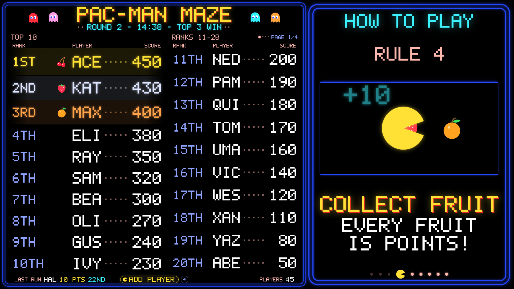

# ᗧ • • • Pac-Man Maze — Live Leaderboard

A retro arcade scoreboard and show controller for the Pac-Man Maze Halloween attraction. It runs
entirely on one Mac mini connected to a TV: no internet, no accounts, no cloud.

Kids run the maze collecting fruit bean bags and, in power mode, tagging ghosts. At the exit, staff
tap in what they brought back (the app adds up the score), the kid picks 3-character initials, and
the TV jumps straight to their spot on the board for a photo. Every 15 minutes the top 3 win candy
and the board starts fresh.



## What it does

- **A live TV leaderboard**: the top 10 pinned, everyone else paging past, a spotlight on each new
  player, and a full-screen celebration for a new high score.
- **How to play, beside the board**: nine animated rules for the kids waiting in line.
- **Scoring made easy**: staff tap the fruit and ghosts; the app does the maths.
- **Prize rounds**: the top players win candy every 15 minutes, then the board clears itself.
- **Run the show from a Stream Deck**: READY, 3·2·1, POWER UP, FINISH, music and volume on physical
  keys, with the sounds and the TV following along.
- **Power-up sensors**: optional ESP32 or Raspberry Pi boards in the maze corners trigger POWER MODE on
  their own.
- **Built for the night**: works offline, saves every score the moment it's added, blocks rude
  initials, and forgives double-taps.

## Quick start

On a Mac with [Node.js 22.18+](https://nodejs.org) and Google Chrome:

```bash
git clone https://github.com/Linesmerrill/pacman-live-leaderboard.git ~/pacman-maze
cd ~/pacman-maze
npm start
```

Then open the screens:

| Screen | Address | Who uses it |
| --- | --- | --- |
| **TV leaderboard**, with a built-in **+ ADD PLAYER** entry panel | `http://localhost:3000/` | Everyone; staff at the Mac |
| Staff entry, for a tablet or laptop | `http://localhost:3000/admin` | Staff on a second device |
| Manage scores | `http://localhost:3000/admin/settings` | Staff: edit, delete, export, reset, settings |

`npm run kiosk` puts the board full-screen on the TV. The full setup, including auto-start after a
restart, is in [Setting up the Mac](docs/setup-mac.md).

## Guides

| Guide | What's in it |
| --- | --- |
| [Setting up the Mac](docs/setup-mac.md) | Installing, starting, full-screen on the TV, auto-start, updating |
| [Running the event](docs/running-the-event.md) | The night's checklist, entering scores, handing out candy, fixing mistakes, backups |
| [How it works](docs/how-it-works.md) | The TV board, the run clock and power pellets, scoring, prize rounds, the rules panel |
| [Settings](docs/settings.md) | Every card in Manage scores, and every key in `config.json` |
| [Stream Deck](docs/stream-deck.md) | Installing the plugin and the 15-key layout, what each key does |
| [Event network](docs/network.md) | The `PacManMaze` Wi-Fi router, and setting it up from scratch |
| [Power-up sensors](docs/sensors.md) | ESP32 / Raspberry Pi corner sensors: parts, wiring, code, testing |
| [Music and sound](docs/music-and-sound.md) | Sound effects, your own recordings, the songs between runs, volume |
| [Troubleshooting](docs/troubleshooting.md) | Something's wrong: find it here |
| [Development](docs/development.md) | Architecture, the API, tests |

## Contributing

Found a bug or have an idea? [Open an issue](https://github.com/Linesmerrill/pacman-live-leaderboard/issues/new/choose).
Want to change something yourself? See [CONTRIBUTING.md](CONTRIBUTING.md).

## License

[MIT](LICENSE). Pac-Man is a trademark of Bandai Namco; this is an unofficial fan project for a local
Halloween attraction.
