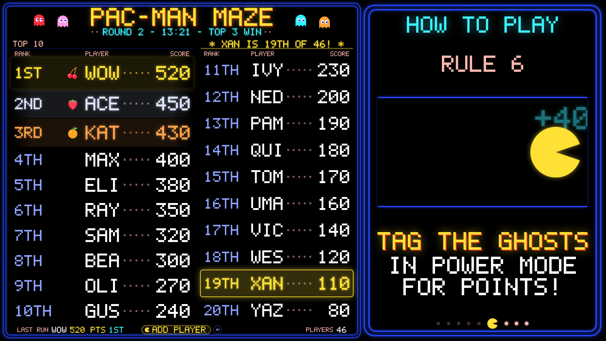
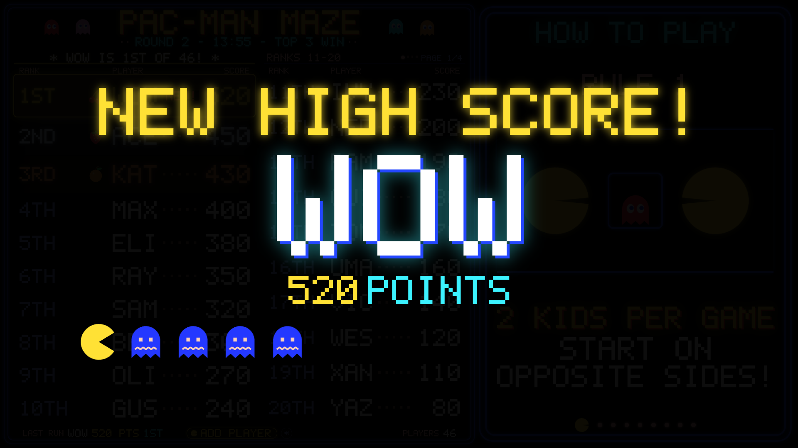
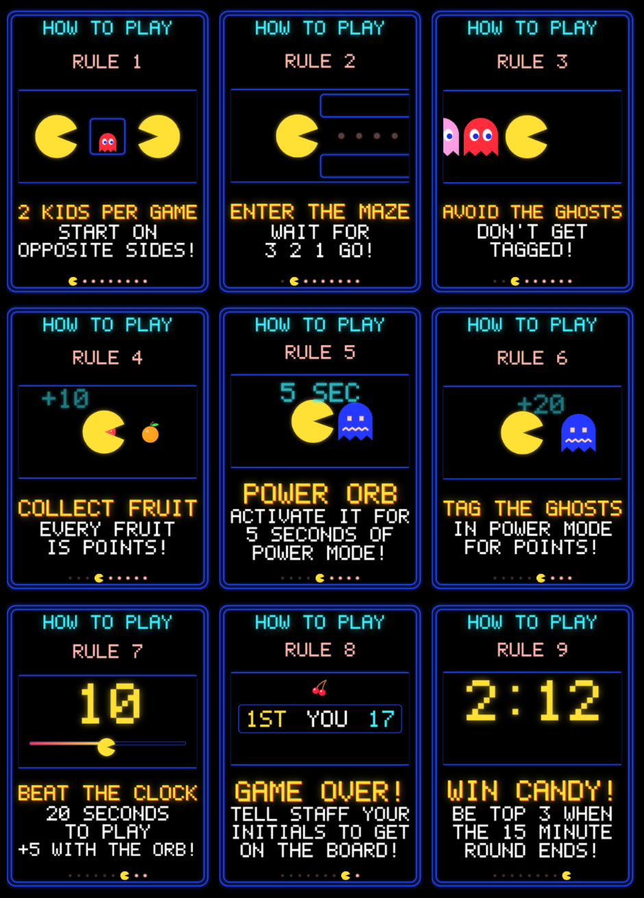
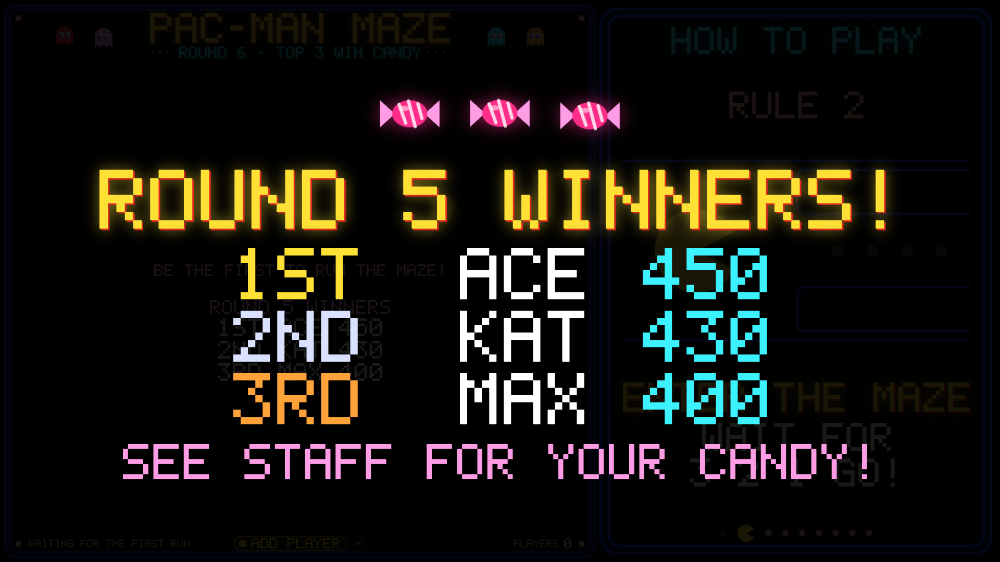

# How it works

What the TV shows and why, how a run is timed, how scores add up, and how prize rounds pick
winners. The settings behind all of this are in [Settings](settings.md).

← [All guides](README.md)

## The TV board


| Spotlight: the TV jumps to each new player | NEW HIGH SCORE! celebration |
| --- | --- |
|  |  |

- The **top 10 are always pinned** on the left, with 1st–3rd in gold, silver and bronze. Tied scores
  share a rank (1st, 1st, 3rd).
- **Everyone else** fills the column beside it (ranks 11–20). With more players, Pac-Man **eats the
  page** every 10 seconds to flip to 21–30, 31–40 and so on, with a page indicator.
- **Spotlight.** When a score is added the TV jumps to that player's page, highlights their row, and
  shows a banner like **`★ SAM IS 20TH OF 57! ★`** for 20 seconds: photo time. **Show on TV** on the
  staff screens, or SPOTLIGHT on the Stream Deck, brings it back.
- **NEW HIGH SCORE!** Beating #1 outright plays a full-screen celebration, then spotlights the new
  leader. Tying #1 doesn't trigger it; the first score of the night does.
- The subtitle shows the **prize round clock**, and the footer shows the **last run** and total
  **players**. A small "RECONNECTING…" note appears only if the TV loses the app for more than
  5 seconds; it reconnects by itself.
- Text sizes itself to fit whatever screen it's on.

## How to play, beside the leaderboard



The TV splits in two: the leaderboard on the left, and on the right the rules for the kids waiting in
line, one at a time, each with a little looping animation:

1. **2 kids per game**, from opposite sides of the maze
2. **Enter the maze**
3. **Avoid the ghosts**
4. **Collect fruit**, with each fruit's points
5. **Power orb**, with the power-mode time from your settings
6. **Tag the ghosts** in power mode, with the ghost points
7. **Beat the clock**, with the run length
8. **GAME OVER**: tell staff your initials
9. **Win candy**, shown only while prize rounds are on

The numbers are quoted from your settings, so the rules stay honest if you change them. The rules
take 40% of the width by default; the leaderboard shows two columns beside them, or three if the
rules are switched off. NEW HIGH SCORE, the 3·2·1 countdown, FINISH and the round winners still take
over the whole screen.

## A run, start to finish

The show is driven by the [Stream Deck](stream-deck.md) (or by the same commands sent over the
network). The app owns the game, so the operator presses one key and the sounds and the TV follow:

```
READY ──► 3·2·1 ──► the run starts by itself ──► POWER UP (from a key or a corner sensor) ──► FINISH
 intro     countdown   clock starts, gameplay        power sound, blue ghosts, walls flash,      music stops,
 sound     on the TV   music, waka                   5 seconds later back to normal play         FINISH! on the TV
```

## The run clock and power pellets

A run has a time limit (**20 seconds** by default). START arms the clock and the TV counts it down;
at zero the run **finishes by itself**, the same as pressing FINISH.

**Power pellets buy time.** A power-up adds the power-pellet time (**5 seconds**) to the clock that's
already running, so a pellet grabbed with 1 second left extends the run instead of restarting it:

```
20s run, pellet grabbed at 0:19
   └─ clock becomes 0:25, power mode runs 0:19 → 0:24
      then normal play resumes for a second and the run finishes at 0:25
```

**Only the first pellet pays.** With the defaults only 1 pellet per run adds time, so a run is 20
seconds and never more than 25, and nobody can loop the maze while others queue. Later pellets still
fire the sound, the blue ghosts and the flashing walls; they just don't add time. A pellet during
power mode starts power mode again from the top.

One clock covers **everyone in the maze at once**, so any pellet counts for the whole group. Set the
run length to `0` for no limit.

## Scoring: fruit and ghosts

Each fruit bean bag is worth points, and so is each ghost tagged in power mode. Staff never add it up:
they tap the fruit and set the ghosts, and the entry panel shows the working
(`2× Strawberry 60 + Orange 50 + 2× Ghosts 60 = 170`). Only the total is saved.

The defaults are the arcade's values ÷ 10, with the first five fruit in the maze:

| Cherry | Strawberry | Orange | Apple | Melon | Galaxian | Bell | Key |
| --- | --- | --- | --- | --- | --- | --- | --- |
| 10 | 30 | 50 | 70 | 100 | 200 *(off)* | 300 *(off)* | 500 *(off)* |

Ghosts double like the arcade: **20, 40, 80, 160** for the 1st to 4th ghost, the last value repeating
after that, so two ghosts are worth 60. The TV's rules show these same values. Change them in
**Manage scores → Scoring**.

## Prize rounds

The board runs in short rounds rather than all night, so kids who are still around can actually win.
With the defaults, **every 15 minutes the top 3 win candy** and the board starts fresh.



- A round's clock starts with its **first score**, so setup time and quiet spells never use one up.
  The TV's subtitle becomes the clock: `ROUND 2 - 12:34 - TOP 3 WIN`.
- When it runs out, the app ends the round on its own. Everyone ranked in the prize places wins
  (**ties included**: two kids tied for 3rd both win). The TV shows **ROUND 2 WINNERS!** with the
  fanfare, the board is **backed up and cleared**, and the next round starts with the next score. A
  kid who scores while candy is being handed out simply lands in the new round.
- The winners stay on the empty TV board, and on the staff entry screen with a tick box each.
- **End round now** and **Restart the clock** are in **Manage scores → Prize rounds**. A round can't
  be ended before it has started. A Mac restart doesn't lose a round: it carries on where it was, or
  ends at once if it ran out meanwhile.

Only initials and scores are kept for winners, the same as the board itself.

## Completion time (optional)

Off by default; turn it on in **Manage scores → Completion timer**. Staff then see a **Completion time
(seconds)** box, and the TV adds a **TIME** column. Ranking is still **highest score first**; equal
scores are broken by the **fastest time**, and untimed runs rank after timed ones with the same score.
With it off, equal scores share a rank and list earliest first.
