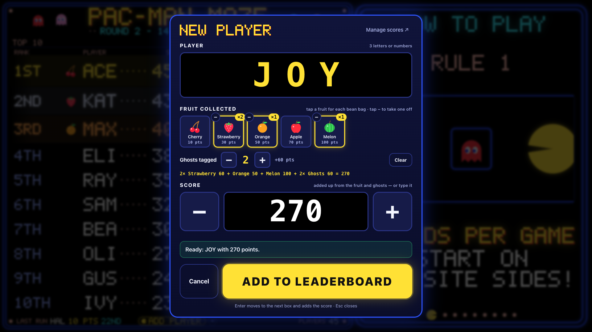
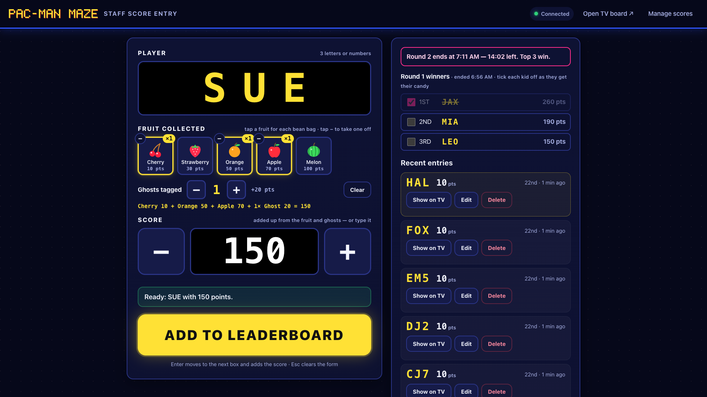
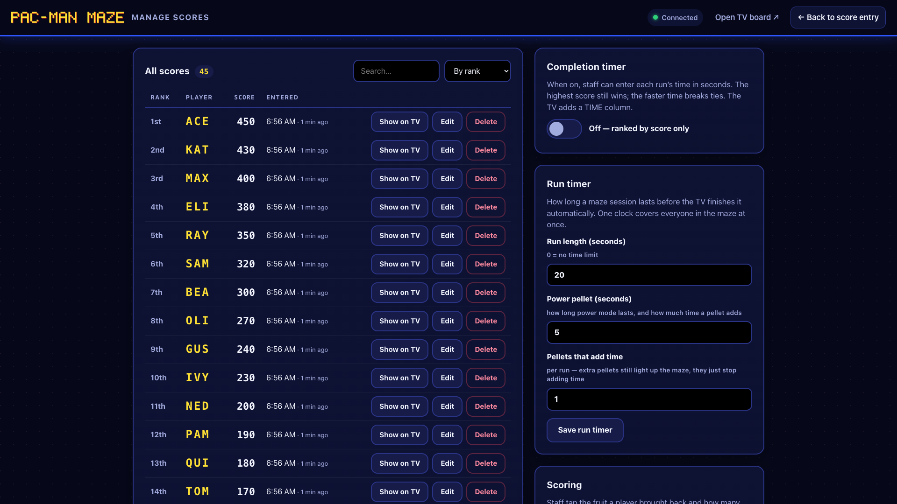

# Running the event

What staff do on the night: getting ready, entering each kid's score, handing out candy, fixing
mistakes, and packing up.

← [All guides](README.md)

## Checklist

**Before the doors open**

1. Plug in the router, then the Mac mini, the TV, the keyboard and mouse (and the Stream Deck).
2. Start the app (`npm start`) and the TV (`npm run kiosk`). If auto-start is set up, both start on
   their own. See [Setting up the Mac](setup-mac.md).
3. Clear last night's scores if they're still there: **Manage scores → Clear leaderboard…** → type
   `RESET`. A backup is saved first.
4. Add a test score, check it appears on the TV, then delete it.
5. Check the sound: press READY on the Stream Deck, or add the test score and listen for the blip.
6. Turn on **Do Not Disturb** on the Mac so nothing pops up on the TV.

**After the event**

1. **Manage scores → Download CSV** and/or **Save backup now**.
2. Copy the `backups/` folder to a USB stick if you want a copy off the Mac.

## Entering a score

Each kid collects fruit bean bags and, in power mode, tags ghosts. At the exit, staff tap in what they
brought back and the app adds up the score. The kid picks 3-character initials (`MAX`, `J07`…).

**Right on the TV**, with a keyboard and mouse plugged into the Mac:

- Click **+ ADD PLAYER** at the bottom of the board, **or just start typing the initials**. The entry
  panel pops open with the first letter already filled in.
- Type 3 letters or numbers. Tap a fruit tile for every bean bag they brought back (tap twice for two
  strawberries, **−** to take one off) and set **Ghosts tagged**. The score fills itself in, with the
  working shown. You can still type it or nudge it with the big **−** / **+**.
- Press **Enter**, or click **ADD TO LEADERBOARD**. The panel closes and the board jumps to the kid.
- **Esc** closes the panel. **Undo** removes the last player you added.

**From a tablet or laptop** on the event Wi-Fi, open `http://192.168.8.10:3000/admin` (the
**On this Wi-Fi** address the app prints at startup). It has the same entry form, plus the recent
entries with **Show on TV**, **Edit** and **Delete**, and the prize round panel.

**Photo time.** When a score is added the TV jumps to that kid's page, highlights their row, and holds
it for 20 seconds with a banner like `★ SAM IS 20TH OF 57! ★`. Missed it? Press **Show on TV** next to
the score, or **SPOTLIGHT** on the Stream Deck.

## Handing out candy

With prize rounds on (the default), **every 15 minutes the top 3 win candy** and the board starts
fresh. The app does this on its own:

- The round clock starts with the round's **first score** and shows in the TV's subtitle.
- When it runs out, the TV shows **ROUND 2 WINNERS!** and "see staff for your candy". Ties win too.
  The board is backed up and cleared.
- The winners stay on the staff entry screen, each with a tick box. **Tick each kid off as they
  collect their candy.**

Need to end a round early, or line rounds up with the hour? **Manage scores → Prize rounds** has
**End round now** and **Restart the clock**. See [How it works](how-it-works.md#prize-rounds) for the
details.

## Fixing mistakes

| Mistake | Fix |
| --- | --- |
| Wrong score or initials | **Edit** in Manage scores or the /admin recent list. The TV updates instantly. |
| Added twice | **Delete** the extra one. Double-taps are already blocked, and the same initials and score within 60 seconds ask "Same player again?" first. |
| Just added the wrong kid | **Undo** in the entry panel. |
| Inappropriate initials got through | **Delete** the score, and add the combo to **Manage scores → Blocked initials** so it can't happen again. |

## Backups, export and reset

Every score is written to disk the moment it's added (`data/pacman-maze.db`). Scores survive browser
refreshes, closed tabs, app restarts and Mac restarts.

| Task | How |
| --- | --- |
| **Export to a spreadsheet** | Manage scores → **Download CSV** (rank, player, score, completion time, when) |
| **Backup** | Manage scores → **Save backup now**, or `npm run backup` in Terminal. Files go to `backups/`. Safe while the app is running. |
| **Reset for a new night** | Manage scores → **Clear leaderboard…** → type `RESET`. A backup is saved first (`backups/pacman-maze-before-reset-….db`). |
| **Restore a backup** | Stop the app (Ctrl+C). Copy the backup over `data/pacman-maze.db`, delete any `data/pacman-maze.db-wal` / `-shm` files, then `npm start`. |

Each prize round that ends is backed up the same way before the board clears.

## Kid safety and privacy

- Initials must be **exactly 3 characters, A–Z or 0–9**. They're uppercased automatically.
- A built-in **blocked-initials list** stops obviously inappropriate combos, including digit
  look-alikes (`A55`, `4SS`). Add your own in **Manage scores → Blocked initials** (`?` is a wildcard,
  e.g. `B?T`). Existing scores that match a newly blocked combo are flagged in red.
- The app stores **only** the 3 characters, the score, the optional time and when it was added. No
  names, ages, emails, phone numbers or photos.
- An optional **staff PIN** (`adminPin` in `config.json`) protects adding, editing and deleting. The
  TV board stays open to view; staff are asked for the PIN once per device.

## Built to forgive staff mistakes

- Big targets, Enter to move on, and a live "Ready: MAX with 120 points" summary before submitting.
- A double-click or double-tap can't add a score twice.
- Clearing the board needs `RESET` typed out, and always makes a backup first.
