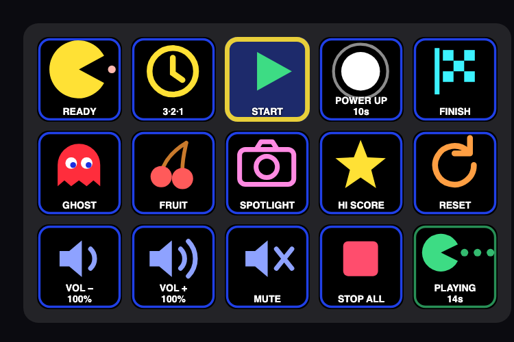

# Stream Deck

An Elgato Stream Deck becomes the attraction's control panel. Each key sends one command to the
leaderboard app, which owns the game, so the operator presses **one** key and the sounds and the TV
follow.

← [All guides](README.md)



```
POWER UP pressed
   ├─ power-up sting, gameplay music swaps to power-mode music
   ├─ TV: ghosts turn blue, maze walls flash, POWER MODE counts down
   └─ 5 seconds later (the power-pellet time), all by itself:
        power-down sound → normal music resumes → back to normal play
```

The same goes for **3·2·1**: the countdown appears on the TV and the run starts on its own, so nobody
has to press three keys in the right order.

## Install

Needs the **Stream Deck app 7.1 or newer**:

```bash
brew install --cask elgato-stream-deck
```

Then, from the project folder:

```bash
npm install                  # once
npm run streamdeck:build
npm run streamdeck:install
npm run streamdeck:profile   # optional: the ready-made 15-key layout
```

`streamdeck:install` quits the Stream Deck app, copies the plugin in, and starts it again.
`streamdeck:profile` writes `apps/streamdeck/profiles/Pac-Man Maze.streamDeckProfile` for the deck
plugged into this Mac. **Double-click it and confirm the import** to place every key at once:

```
READY   3·2·1   START      POWER UP    FINISH
PREV    NEXT    SPOTLIGHT  HI SCORE    RESET
VOL −   VOL +   MUTE       STOP ALL    STATUS
```

Prefer to arrange it yourself? Skip the profile, open the **Pac-Man Maze** category in the Stream
Deck actions list, and drag the keys over one at a time. Each key already knows its job; there's
nothing to configure.

After updating the project, run `streamdeck:build` and `streamdeck:install` again.

## The keys

| Key | What happens |
| --- | --- |
| **READY** | Intro sound, the TV shows `READY!` |
| **3·2·1** | Countdown on the TV, then the run starts by itself |
| **START** | Starts the run, the run clock and the gameplay music |
| **POWER UP** | Power mode for the power-pellet time (5 seconds by default), then back to normal play automatically. Also adds time to the run; see [How it works](how-it-works.md#the-run-clock-and-power-pellets) |
| **FINISH** | Ends the run: music stops, `FINISH!` on the TV |
| **PREV / NEXT** | Skip the background music back or forward a song; the TV shows the song's name |
| **SPOTLIGHT** | Puts the player who just scored back on the TV and holds their page, for the photo |
| **HI SCORE** | Plays the high-score fanfare on demand |
| **RESET** | Back to the idle leaderboard |
| **VOL − / VOL + / MUTE** | TV volume and mute, saved so they survive a restart |
| **STOP ALL** | Silences everything without changing the game |
| **STATUS** | Presses nothing: shows the game state, the seconds left and how many players are on the board |

The actions list also has **GHOST TAG**, **FRUIT** and **PAC-DOT** (one-shot sounds, left off the
layout to make room for the music keys) and **Game Action (pick one)**, a spare key you choose the job
for in its settings.

**The keys show what's happening.** POWER UP counts its seconds down, the VOL keys show the volume,
MUTE shows when sound is off, the live step lights up, keys that don't apply right now are dimmed, and
every key shows `(offline)` if the leaderboard isn't running.

## Settings

Each key has an optional **Connection** section. Fill it in on *one* key; every Pac-Man Maze key on
the deck shares it.

- **Leaderboard address.** Leave blank for `http://localhost:3000`. Set it if the leaderboard runs on
  another Mac (at the event, `http://192.168.8.10:3000`) or another port.
- **Staff PIN.** Only needed if `adminPin` is set in `config.json`.

## No Stream Deck?

The same commands work from anything that can send a web request on the event network:

```bash
curl -X POST http://localhost:3000/api/game/power-up
```

The commands are `ready`, `countdown`, `start`, `power-up`, `ghost-tag`, `fruit`, `pac-dot`,
`high-score`, `spotlight`, `finish`, `stop-all`, `reset`, `volume-up`, `volume-down`, `mute`,
`music-prev` and `music-next`. The [power-up sensors](sensors.md) use exactly this.

## Pressing keys from an AI assistant (optional)

Elgato ships an MCP server that talks to the running Stream Deck app. [`.mcp.json`](../.mcp.json)
registers it for Claude Code. It needs **MCP Actions** switched on in the Stream Deck app, and the
internet, because it's fetched from npm on each start. The attraction never needs it.

It can list the installed actions, list what's on the deck, and *press* a key, which is handy for
checking a real deck without standing at it. It can't arrange keys; that's still the profile or
dragging them by hand.

## If something's wrong

See [Troubleshooting → Stream Deck](troubleshooting.md#stream-deck). Changing the plugin's code is
covered in [`apps/streamdeck/README.md`](../apps/streamdeck/README.md).
